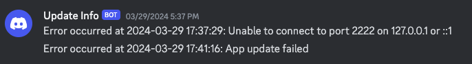

## Dependencies

- python >=3.9.2
- twilio
- requests
- paramiko
- pandas
- tabulate

### Installing dependencies

    pip install -r requirements.txt

## Running the program from project root

    python3 main.py

## Expected output

| Student | Biology | Mathematics | Arts | Chemistry | Programming | Geography | Physics | Astronomy | History | Robotics |
| --- | --- | --- | --- | --- | --- | --- | --- | --- | --- | --- |
| Abbigail Barrera (24) | 4 | 5 | 4 | 4 | 2 | 2 | 2 | 3 | 4 | 2 |
| Abigayle Hogan (23) | 2 | 4 | 5 | 2 | 2 | 2 | 2 | 2 | 3 | 3 |
| Adrian Abbott (25) | 4 | 2 | 3 | 4 | 3 | 4 | 5 | 2 | 5 | 5 |
| Aidyn Gilbert (30) | 3 | 5 | 4 | 4 | 4 | 4 | 3 | 2 | 4 | 3 |
| Alayna Hardy (31) | 3 | 5 | 5 | 4 | 2 | 2 | 2 | 2 | 2 | 3 |
| Aldo Leach (28) | 5 | 5 | 5 | 2 | 3 | 3 | 3 | 2 | 4 | 5 |
| Alijah Whitney (31) | 5 | 2 | 2 | 5 | 4 | 2 | 3 | 3 | 5 | 5 |
| Alondra Duran (23) | 2 | 2 | 2 | 5 | 3 | 4 | 5 | 4 | 5 | 3 |

## Error handling

If we fail to make an SSH connection, we try to restart the container, in this implementation we simply look for the latest container running the **sql_task** image since that was used in the task description. Should the program run into any exceptions that make it out of the main program look we catch them and send out timestamped error messages via Discord and SMS (Twilio). To test SMS feature, credentials must be added to the NotificationSender class, since Twilio automatically resets secrets if one is pushed to GH.

### Discord Message

### Twilio Message

